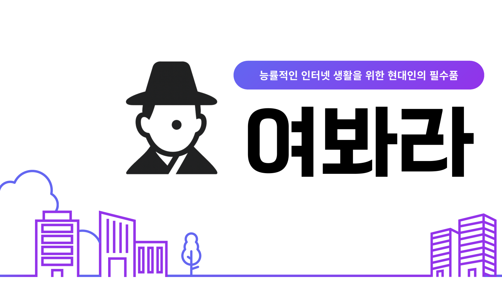
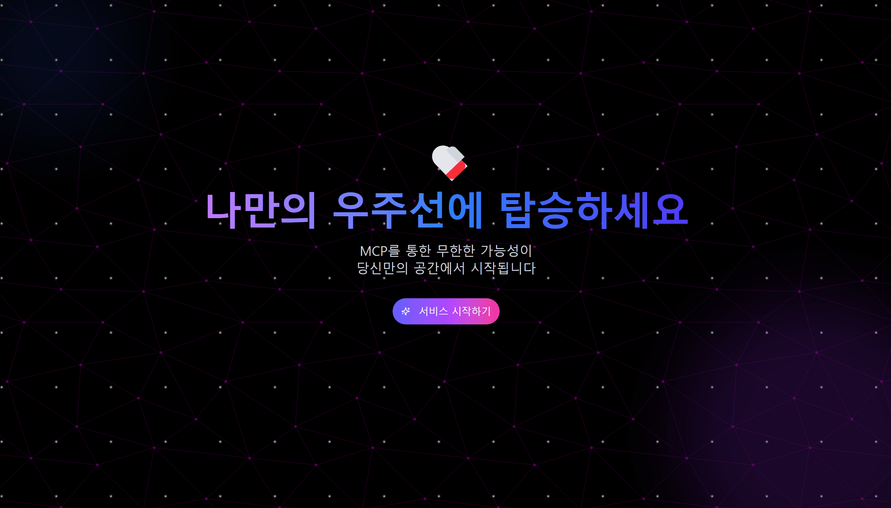
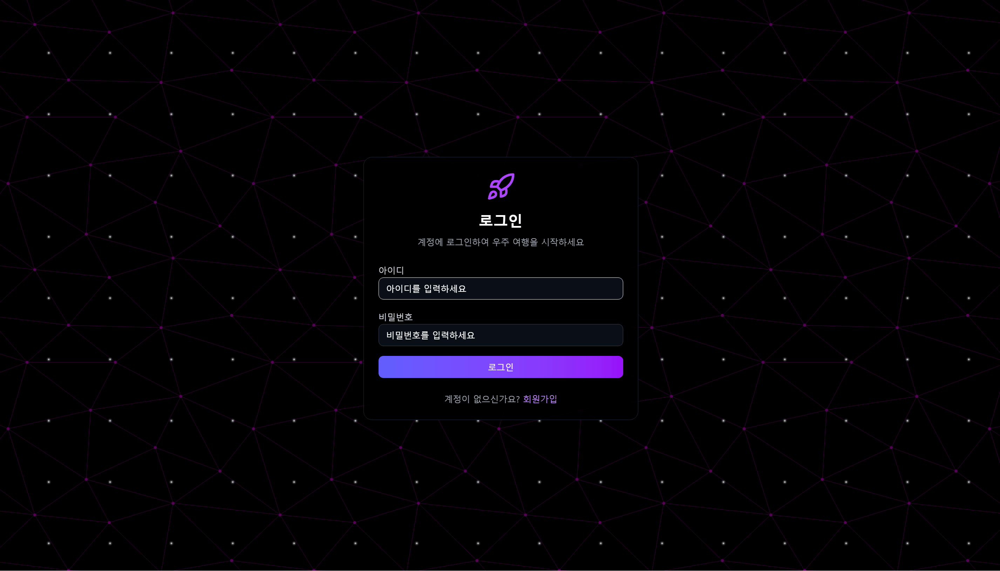
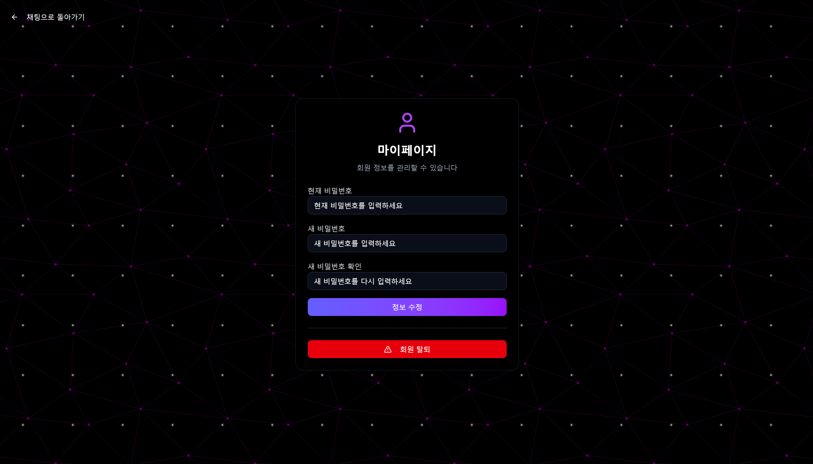
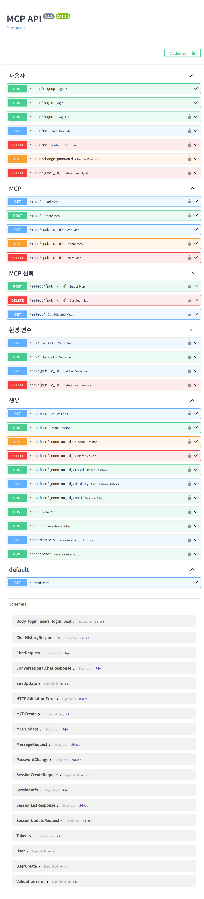

# 🔎 능률적인 인터넷 생활을 위한 현대인의 필수품, 여봐라 🔎

## 🔖 목차
### [1️⃣ 서비스 소개](#1️⃣-서비스-소개)
### [2️⃣ 기능 소개](#2️⃣-기능-소개)
### [3️⃣ 주요 기능](#3️⃣-주요-기능)
### [4️⃣ 기술스택](#4️⃣-기술스택)
### [5️⃣ 시스템 아키텍쳐](#5️⃣-시스템-아키텍쳐)
### [6️⃣ 산출물](#6️⃣-산출물)
### [7️⃣ 팀원 소개 및 역할](#7️⃣-팀원-소개-및-역할)

---

## 1️⃣ 서비스 소개
여봐라는 웹 기반 MCP (Model Context Protocol) 플랫폼으로, AI 에이전트를 통해 다양한 외부 서비스를 통합 관리할 수 있는 시스템입니다.
사용자는 로그인 후 Notion API, GitLab, OpenAI 등 여러 MCP 모듈을 등록하여 하나의 웹 인터페이스에서 실시간 채팅을 통해 명령을 내리고 결과를 확인할 수 있습니다.

### 기간
- 2025.04.14 ~ 2025.05.22 (6주)

### 기획 배경
현대의 개발자와 지식 근로자들은 업무를 위해 Notion, GitLab, ChatGPT, Google Drive 등 다양한 웹서비스를 동시에 사용합니다.
특히 프로젝트 관리 시 GitLab에서 이슈 확인 → Notion에서 회의록 작성 → AI에게 코드 분석 요청 → 다시 GitLab에 커밋 하는 과정에서 여러 탭을 오가며 반복적인 작업과 컨텍스트 전환으로 인한 피로감을 경험하게 됩니다.
기존 AI 챗봇들은 단일 서비스 내에서만 동작하거나, 각 서비스마다 별도의 API 연동 작업이 필요해 통합적인 업무 처리가 어려웠습니다.
이러한 문제를 해결하기 위해 **MCP(Model Context Protocol)**를 활용하여 하나의 AI 에이전트가 여러 외부 서비스를 자동으로 연동하고, 사용자는 자연어 대화만으로 모든 업무를 처리할 수 있는 통합 에이전트 플랫폼을 기획하게 되었습니다.

---

## 2️⃣ 기능 소개
- **로그인 / 회원가입**  
  - 이메일과 비밀번호로 간편하게 가입 및 로그인  
- **MCP 서비스 설정**  
  - 채팅 페이지 우측 설정 아이콘 클릭 → 서비스별 환경변수 입력  
  - 사용 여부 토글로 On/Off  
- **채팅**  
  - 좌측 사이드바: 새 채팅 생성 및 히스토리 확인  
  - 우측 사이드바: MCP 서비스 가이드라인 확인  
  - 하단 입력창: 메시지 전송 → 실시간 응답 & Action  
- **마이페이지**  
  - 비밀번호 변경  
  - 회원 탈퇴  

---

## 3️⃣ 주요기능
| 랜딩 페이지 | 회원가입 |
|:----:|:----:|
|  |  |

| 로그인 | 마이페이지 |
|:----:|:----:|
|  |  |

| 챗봇 서비스 |
|:----:|
|  |
 
| MCP 서비스 설정 |
|:----:|
|  |
 
| MCP 서비스 사용 - Notion |
|:----:|
|  |

| MCP 서비스 사용 - Airbnb + Notion |
|:----:|
|  |
 
---

## 4️⃣ 기술스택
<table>
  <tr>
    <th>인프라 &amp; 오케스트레이션</th>
    <td>
      
      
      
    </td>
  </tr>
  <tr>
    <th>클라우드 &amp; 배포</th>
    <td>
      
      
      
      
    </td>
  </tr>
  <tr>
    <th>웹서버</th>
    <td>
      
    </td>
  </tr>
  <tr>
    <th>프론트엔드</th>
    <td>
      
      
      
      
      
      
      
    </td>
  </tr>
  <tr>
    <th>백엔드</th>
    <td>
      
    </td>
  </tr>
  <tr>
    <th>데이터베이스</th>
    <td>
      
    </td>
  </tr>
  <tr>
    <th>기타</th>
    <td>
      
      
      
      
      
      
    </td>
  </tr>
</table>

---

## 5️⃣ 시스템 아키텍쳐

---

## 6️⃣ 산출물

### [기능 명세서](https://dbdiagram.io/d/680edbf41ca52373f592262a)

### [ERD](https://dbdiagram.io/d/680edbf41ca52373f592262a)

### [포팅 매뉴얼](https://github.com/chano275/yeowbara/blob/master/exec/porting_manual.pdf)

### API 명세서

---

## 7️⃣ 팀 구성원 및 역할
<table>
  <tr>
    <td align="center">
      
    </td>
    <td align="center">
      
    </td>
    <td align="center">
      
    </td>
  </tr>
  <tr>
    <td align="center"><strong>정찬호</strong> <strong>팀장 / DevOps / PM</strong></td>
    <td align="center"><strong>김의찬</strong> <strong>BE</strong></td>
    <td align="center"><strong>나유빈</strong> <strong>FE</strong></td>
  </tr>
</table>
